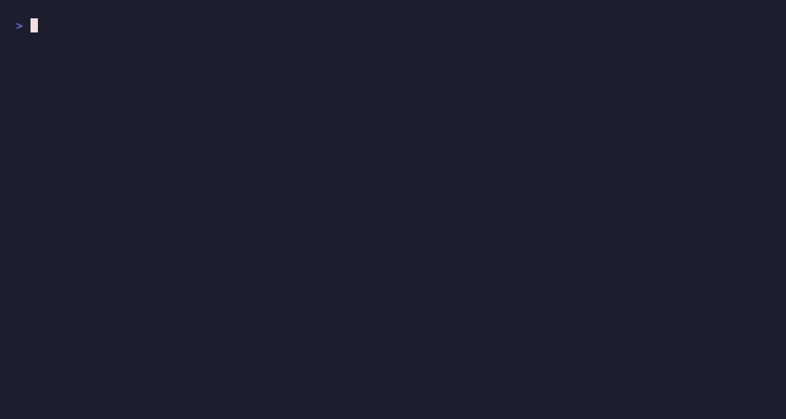

# aidemo — your coding agent makes the demo video

**[aidemo.top](https://aidemo.top)** · [showcase with narration ▶](https://github.com/tandryukha/aidemo/releases/download/v0.3.0/wikipedia-showcase-demo.mp4) · [quick start](#quick-start-self-contained-smoke-test) · [the skill](.claude/skills/record-demo/SKILL.md)

**Tell your coding agent *"record a 45s demo of the checkout flow"* — get back
a polished MP4 with voiceover, synced captions, and auto-zoom.** The agent
(Claude Code today, via the bundled `record-demo` skill) writes one
`storyboard.json` — the script, per-scene voice/music plan, and a browser
action-spec — and the engine drives a real Chrome, records a deterministic
replay, generates a realistic voiceover, aligns captions, and trims the dead
time. An **open-source alternative to Screen Studio, Clueso, or Demosmith**
for when you'd rather your coding agent make the demo — no screen-recording
session, no cloud upload, works against localhost and auth-walled apps.

[](https://aidemo.top)
[](https://github.com/tandryukha/aidemo/actions/workflows/ci.yml)
[](LICENSE)
[](https://github.com/tandryukha/aidemo/releases)
[](.claude/skills/record-demo/SKILL.md)
[](https://scorecard.dev/viewer/?uri=github.com/tandryukha/aidemo)

**Works with:** Claude Code (today) · Codex CLI / Gemini CLI (planned, via an
agent-neutral authoring doc + MCP server) · any human or agent that can write a
`storyboard.json` and run `aidemo render`.

[](https://github.com/tandryukha/aidemo/releases/download/v0.3.0/wikipedia-showcase-demo.mp4)

<sub>Real output — a ~51 s self-narrated tour of Wikipedia (portal search →
Ada Lovelace → focus-zoom → click through to the Analytical Engine → glide
scroll), authored by Claude from one `storyboard.json` and recorded as a
deterministic replay. The preview GIF is silent;
**[watch the full version with narration ▶](https://github.com/tandryukha/aidemo/releases/download/v0.3.0/wikipedia-showcase-demo.mp4)**.</sub>

```
storyboard.json
   → voice     OpenAI TTS per scene           → audio/narration.mp3 + voice.json
   → record    drives Chrome, injected cursor  → recordings/raw.{webm,mp4} + timeline.json
   → captions  Whisper word timestamps         → generated/captions.{srt,vtt,cues.json}
   → compose   trim idle · sync · auto-zoom · cards · caption · mux → output/final-demo.mp4
```

The design goal: demos that look **human-made and snappy**, not like an AI
clicking around and waiting between screenshots. It does that by separating
**authoring** (slow, one-time — figure out the flow) from **recording** (a fast
deterministic replay with a smooth animated cursor).

## Use cases

One engine, every demo a repo needs:

- **GitHub README demos** — render once, `aidemo gif demos/onboarding`, drop
  the autoplaying GIF into the readme (the Wikipedia and quickstart GIFs on
  this page are exactly that).
- **Landing-page hero videos** — the muted-autoplay MP4 on
  [aidemo.top](https://aidemo.top) is a rendered demo, poster frame and all.
- **Release / what-shipped demos** — narrate the new feature, then
  `gh release upload v1.4.0 demos/whats-new/output/final-demo.mp4`.
- **Customer & prospect demos** — personalized flows against your real app:
  localhost, auth walls, your own logged-in Chrome; nothing leaves the machine.
- **Progress demos** — end of sprint, tell your agent *"record what we shipped
  this week"* and let it author + render in the background while you keep
  working.

## Why it's built this way (key decisions)

- **Deterministic replay, not an LLM in the loop.** The recording runs a fixed
  action-spec at full speed, so the video is smooth. The agent is used only to
  *author* the storyboard (and confirm selectors once), never during capture.
- **Declarative action-spec + fixed player** (not generated `spec.ts`). Safer,
  editable, and it emits a **timeline** for free.
- **Timeline-driven sync.** The player records each scene's span and every idle
  ("thinking") wait. Compose then fits each scene's video to its narration
  length by trimming/speeding only the idle parts, and **freeze-holds** a static
  page for any remainder instead of ugly slow-motion.
- **Captions via overlaid PNGs, not libass.** Many ffmpeg builds ship without the
  `subtitles`/`drawtext` filters. We rasterize each caption to a transparent PNG
  with headless Chrome (full CSS control) and overlay it with time-gated
  `enable` — works on any ffmpeg with `overlay`.
- **Swappable voice provider.** OpenAI `gpt-4o-mini-tts` by default, but any
  OpenAI-compatible server works — see
  [Local models & offline](#local-models--offline). The `VoiceProvider`
  interface leaves room for ElevenLabs later.
- **Cinematic polish is compose-time, not record-time.** The player only
  *records* where attention went (clicks, typing, `focus` actions); the zoom
  choreography is rendered afterwards with ffmpeg `zoompan`, so a bad zoom is a
  recompose, never a re-record.

## Cinematic polish

All opt-in via the storyboard; existing storyboards render exactly as before.

- **Auto-zoom on focus** (Screen-Studio-style). Add `"zoom": {}` at the top
  level (options: `scale` 1.55, `easeMs` 600, `holdMs` 1700). Every click and
  typed prompt eases the camera in on the interaction point, holds, and eases
  back out — consecutive focus points pan instead of bouncing. Opt a busy scene
  out with `"zoom": false` on the scene, or add a deliberate framing beat with
  the `{op:"focus", target, scale?, holdMs?}` action (no click needed).
- **Smooth-scroll easing presets.** `scrollTo`/`scrollBy` accept
  `"easing": "smooth" | "snappy" | "glide" | "linear"` (+ optional
  `durationMs`). Scrolls run as ~60 Hz eased micro-deltas instead of chunky
  wheel steps.
- **Dynamic music ducking (sidechain).** With `music.track` set, narration keys
  a sidechain compressor on the bed: music dips under speech and swells back in
  pauses and over the cards. Tune with `gainDb` (bed level, default -14),
  `duckThreshold/duckRatio/duckAttackMs/duckReleaseMs`; `"ducking": "constant"`
  restores the old fixed `duckToDb` bed. The bed fades out over the last
  `fadeOutMs` (1800) of the video.
- **Intro/outro cards.** `"intro"` / `"outro"` objects (`title`, `subtitle?`,
  `durationMs`, `background?`, `accent?`, `fadeMs?`) render as typographic
  title cards (headless-Chrome rasterized, like captions) with fade in/out.
  Narration and captions shift automatically; music plays under the cards.

## Higher-fidelity capture (native / OBS)

Playwright's built-in recording is a CDP screencast — fine for fixtures, softer
for hero demos. `--capture native|obs` (or `AIDEMO_CAPTURE`) records the real
screen instead and crops to the browser viewport automatically (window geometry
is measured from the page). Retina density is preserved end-to-end: compose is
resolution-aware, so captions/cards/zoom render at 2x on a 2x capture.

- `--capture native` (macOS): ffmpeg `avfoundation` grab of the primary screen.
  Grant your terminal **Screen Recording** permission. Device via
  `AIDEMO_CAPTURE_DEVICE` (default "Capture screen 0"; list with
  `ffmpeg -f avfoundation -list_devices true -i ""`).
- `--capture obs`: OBS Studio via obs-websocket v5 (`AIDEMO_OBS_URL`,
  `AIDEMO_OBS_PASSWORD`; needs Node 22+). Set the OBS scene to a **Display
  Capture of the primary screen**; start/stop is automated.

Both need a **headed** browser (they record the actual screen — keep the window
unobstructed and don't move it mid-take).

## Setup

Prereqs: **Node 20+**, **Google Chrome**, **ffmpeg + ffprobe** on `PATH`.

**Platform support:** developed and tested on macOS. Linux should work for the
default (Playwright) capture and `--capture obs`, but is untested; Windows is
untested. `--capture native` is macOS-only (ffmpeg `avfoundation`) — use
`--capture obs` for high-fidelity capture on other platforms. Run
`aidemo doctor` to check your setup; platform reports welcome via
`aidemo feedback`.

```bash
npm install
cp .env.example .env      # then add OPENAI_API_KEY (or point OPENAI_BASE_URL
                          # at a local server — see "Local models & offline")
```

No Playwright browser download is needed — the engine uses your system Chrome
(`channel: "chrome"`).

## Quick start (self-contained smoke test)

A bundled fixture store (search → results → cart → checkout) that renders a
finished demo with zero external dependencies:

```bash
node examples/local-demo/serve.mjs        # terminal 1: fixture on :8787
node bin/aidemo.mjs render examples/local-demo --headless   # terminal 2
open examples/local-demo/output/final-demo.mp4   # xdg-open on Linux, start on Windows
```



[](https://github.com/tandryukha/aidemo/releases/download/v0.3.0/quickstart-demo.mp4)

<sub>The run, and what it produces — narrated, captioned, auto-trimmed. Silent
preview; **[full version ▶](https://github.com/tandryukha/aidemo/releases/download/v0.3.0/quickstart-demo.mp4)**.</sub>

(You can also `npm link` to get a global `aidemo` command instead of
`node bin/aidemo.mjs`.)

## CLI

Each step is independently runnable and re-runnable — regenerate voice without
re-recording, recompose without re-transcribing, etc.

```bash
aidemo init <name>            # scaffold demos/<name>/ with a starter storyboard
aidemo voice   <dir>          # per-scene TTS → narration.mp3 + voice.json
aidemo voice   <dir> --scene s3   # regenerate just one scene's narration
aidemo voice   <dir> --force  # re-synthesize every scene (ignore the hash cache)
aidemo record  <dir>          # drive Chrome → raw video + timeline.json
aidemo probe   <dir>          # record-only dry run; narration optional (verify selectors)
aidemo captions <dir>         # Whisper → captions.{srt,vtt,cues.json}
aidemo captions <dir> --offline   # approximate captions from the script — no network
aidemo compose <dir>          # trim + sync + zoom + cards + caption + mux → final-demo.mp4
aidemo gif     <dir>          # final-demo.mp4 → README-ready GIF (autoplays on GitHub)
aidemo render  <dir>          # voice → record → captions → compose
aidemo music   [out.wav]      # synthesize a license-free background-music bed
```

Add `--headless` for CI/fixtures; omit it for real sites that need your logged-in
session (headed real Chrome). `--profile <dir>` picks the Chrome user-data dir.
`--capture native|obs` (on record/render) switches to the high-fidelity
screen-capture path.

**Reliability niceties.** `voice`/`render` **skip TTS for unchanged scenes** (a
per-scene hash of narration + voice plan lives in `voice.json`), so re-runs are
cheap and don't discard an approved take — `--force` / `--force-voice` overrides.
`record` **salvages a failed take**: it still writes a partial `timeline.json`
and keeps the main recording, and on any action error it names the failing
scene/action and drops a screenshot + frame dump in `logs/` (also, every command
tees its own output to `logs/<command>.log`, so you don't need `| tee` — which
would mask the exit code unless you `set -o pipefail`).

## Local models & offline

TTS (`voice`) and transcription (`captions`) are the **only two network calls
in the pipeline**, and both go through the OpenAI SDK — so both can be pointed
at any OpenAI-compatible server. Everything else — recording, composing, music
synthesis, caption/card rendering — is local Chrome + ffmpeg already.

```bash
OPENAI_BASE_URL=http://localhost:8000/v1        # or AIDEMO_OPENAI_BASE_URL
AIDEMO_TTS_MODEL=speaches-ai/Kokoro-82M-v1.0-ONNX   # default: gpt-4o-mini-tts
AIDEMO_STT_MODEL=Systran/faster-whisper-small       # default: whisper-1
```

With a custom base URL set, **no `OPENAI_API_KEY` is needed**. `aidemo doctor`
reports which endpoint is in effect.

**One-server recipe — [speaches](https://speaches.ai)** covers both halves
(faster-whisper STT with word timestamps + Kokoro TTS):

```bash
docker run --rm --detach --publish 8000:8000 \
  --volume hf-hub-cache:/home/ubuntu/.cache/huggingface/hub \
  ghcr.io/speaches-ai/speaches:latest-cpu     # :latest-cuda if you have a GPU
uvx speaches-cli model download speaches-ai/Kokoro-82M-v1.0-ONNX
uvx speaches-cli model download Systran/faster-whisper-small
```

Then set the three env vars above and pick a voice the model knows in your
storyboard's voice plan (Kokoro: `af_heart`, `am_adam`, …). This exact stack is
verified: the bundled fixture renders end-to-end against it — real Kokoro
narration, word-timed faster-whisper captions, no API key.
[Kokoro-FastAPI](https://github.com/remsky/Kokoro-FastAPI) or
[LocalAI](https://localai.io) also work for the TTS half.

**Caveat: caption sync needs word-level timestamps**, so the STT server must
support `timestamp_granularities=word` — speaches does; whisper.cpp's compat
layer may not. If yours doesn't (or you want zero network at all),
`aidemo captions <dir> --offline` derives approximate captions from the script
plus the per-scene timings in `voice.json` — no transcription call, close
enough for most demos.

**What leaves the machine:** with the default config, the narration script goes
to the TTS endpoint and the narration audio to the transcription endpoint —
that's the whole surface, and only when you run `voice`/`captions`/`render`.
Point the base URL at localhost and nothing leaves at all. There's no telemetry
anywhere; `aidemo feedback` and `aidemo skill update` touch GitHub only when
you explicitly invoke them.

## Authoring a storyboard

See `examples/local-demo/generated/storyboard.json` for a working example and the
`record-demo` skill (`.claude/skills/record-demo/SKILL.md`) for the schema, the
action vocabulary, and demo-director principles. In short: 4-6 scenes, one idea
each, ~2.5 words/sec of narration, hook first, CTA last; use `waitForWidget` for
every async "thinking" wait so it gets trimmed.

The easiest way to make one: ask Claude — *"record a 45s demo of &lt;flow&gt;"* — and the
`record-demo` skill drives the whole thing:


<sub>A real session, unedited except the middle ~7 minutes being fast-forwarded:
Claude Code loads the skill, writes the storyboard, probes the selectors with a
record-only dry run, renders, then iterates narration length from a 38.9s cut
to 43.8s by re-running only voice → captions → compose — and reports back.</sub>

## Recording ChatGPT apps (Apps SDK widgets)

An Apps SDK app renders as a **sandboxed iframe widget** inside chatgpt.com,
invoked by natural language. To record one:

1. Create a **dedicated Chrome profile**, open it, and log into ChatGPT with
   your app's dev connector enabled. Note its user-data dir.
2. Point the engine at it: set `AIDEMO_CHROME_PROFILE=/path/to/profile` in `.env`
   (or pass `--profile`). **Quit any Chrome using that profile first** — Playwright
   needs exclusive access.
3. In the storyboard, declare the widget iframe under `frames`, type into the
   composer with `{ "named": "composer" }`, and target widget elements with
   `{ "frame": "widget", "selector": "..." }`, waiting via `waitForWidget`.
4. Run headed: `aidemo render demos/<name>` (no `--headless`).

Because it's your genuine, logged-in Chrome, ChatGPT's bot detection isn't a
factor. Model replies still vary run-to-run, so review and re-run if a take is
off — the storyboard and narration stay the same. The `record-demo` skill
documents the hard-won specifics (nested-iframe descent, login/keychain,
Cloudflare, interruption screens).

## Project layout (per demo)

```
demos/<name>/          ← your working area (untracked; scaffold with `aidemo init`)
  input/      brief.md
  generated/  storyboard.json  timeline.json  captions.{srt,vtt,cues.json}
  recordings/ raw.webm (or raw.mp4 for native/OBS capture)
  audio/      scene-*.mp3  narration.mp3  voice.json
  output/     final-demo.mp4
  logs/       <command>.log  fail-<scene>-<n>.{png,json} (on a failed action)
```

## Roadmap

- **Codex CLI / Gemini CLI support**: extract the skill's authoring knowledge
  into an agent-neutral `docs/AUTHORING.md`, thin `AGENTS.md`/`GEMINI.md`
  adapters, then an **MCP server** (`aidemo mcp`) exposing author/probe/render
  as tools for any agent.
- **GitHub Action**: attach a freshly rendered demo video to every release —
  "make a demo of what shipped since the last tag".
- **ElevenLabs voice provider** behind the existing `VoiceProvider` interface
  (higher-emotion narration).
- **Comments on the video** (pause & comment) and **in-place transcript editing**:
  captions map to scenes, so editing a line marks that scene dirty and
  `aidemo voice --scene <id>` + `compose` regenerates only the delta.
- **Web UI**, project history, brand kits, changelog integrations.

(Cinematic polish — auto-zoom, scroll easing presets, sidechain music ducking,
intro/outro cards — and the native/OBS capture path shipped; see above.)

## Notes / limitations

- LLM-driven pages (like ChatGPT) respond non-deterministically; treat a bad
  take as a re-run, not a bug. Selectors inside widget iframes can change —
  confirm them by driving the real page once (the skill does this).
- Caption text comes from Whisper words (no punctuation); grouping is
  scene-aligned but not sentence-perfect. Editing captions in place is a roadmap
  item.

## Security & trust

- **No telemetry, no analytics, no install-time scripts** (`package.json` has
  no `postinstall`/`preinstall`).
- **Network access is exactly two endpoints, both user-initiated:**
  `api.openai.com` (only for `aidemo voice` / `aidemo captions`, with your own
  `OPENAI_API_KEY` — or a local server of your choice via `OPENAI_BASE_URL`,
  see [Local models & offline](#local-models--offline)) and `github.com` (only
  via your own locally-authenticated `gh` CLI, for `aidemo feedback`).
  Recording and composing are fully local — Playwright and ffmpeg spawned on
  your machine.
- **Small, auditable surface:** ~20 source files under `src/`, 5 runtime
  dependencies (`commander`, `openai`, `playwright`, `tsx`, `zod`), MIT.
- Wary of the moving `#stable` tag? Pin an immutable ref:
  `npx -y github:tandryukha/aidemo#v0.3.0` or a full commit SHA.
- Found a vulnerability? See [SECURITY.md](SECURITY.md) — please report
  privately, not via a public issue.

## Contributing

Issues and PRs welcome — see [CONTRIBUTING.md](CONTRIBUTING.md) for dev setup,
the smoke test, and the DCO sign-off requirement. Recording-session feedback
has a fast path: `aidemo feedback demos/<name>` pre-fills a structured issue.

## License

[MIT](LICENSE) © Andrii Taran
